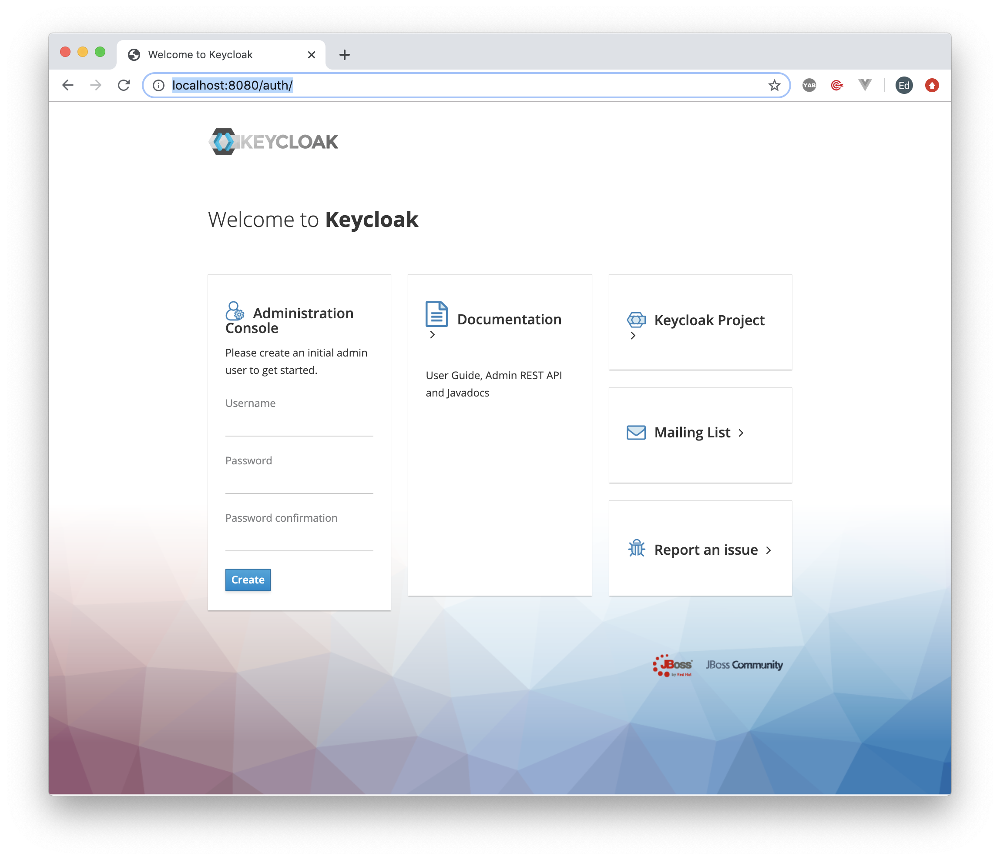
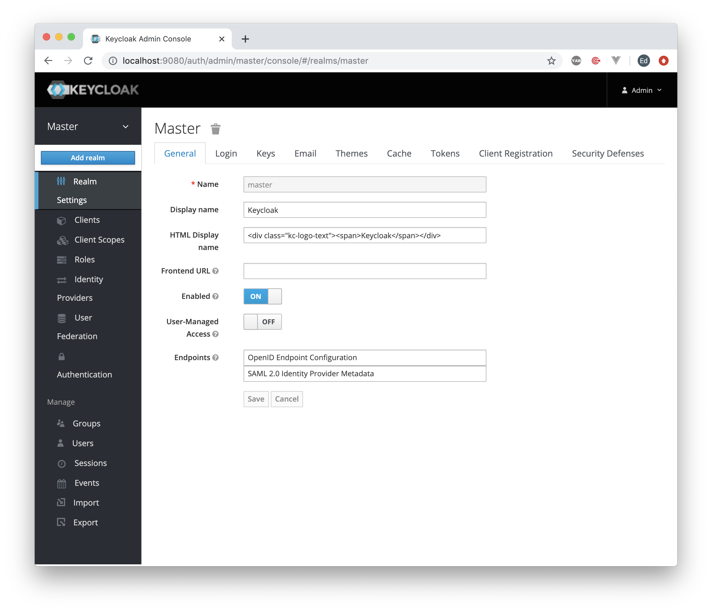
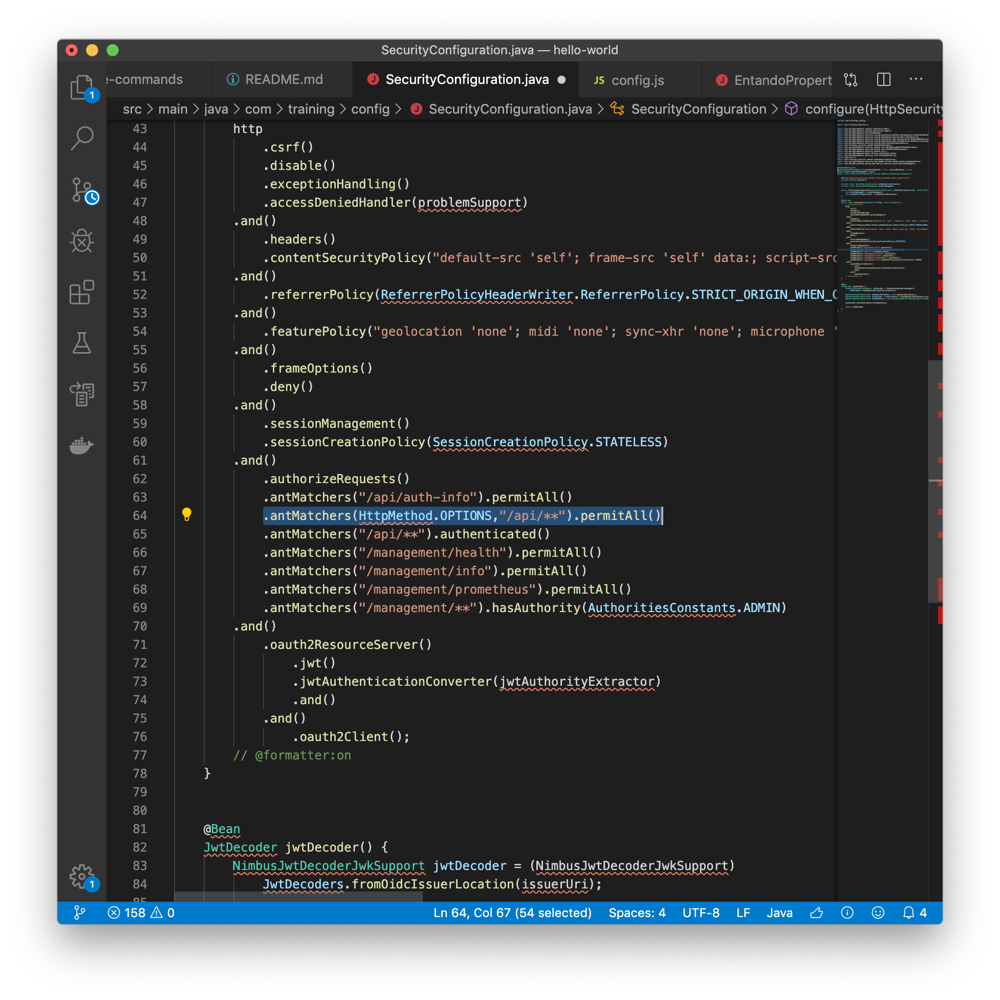
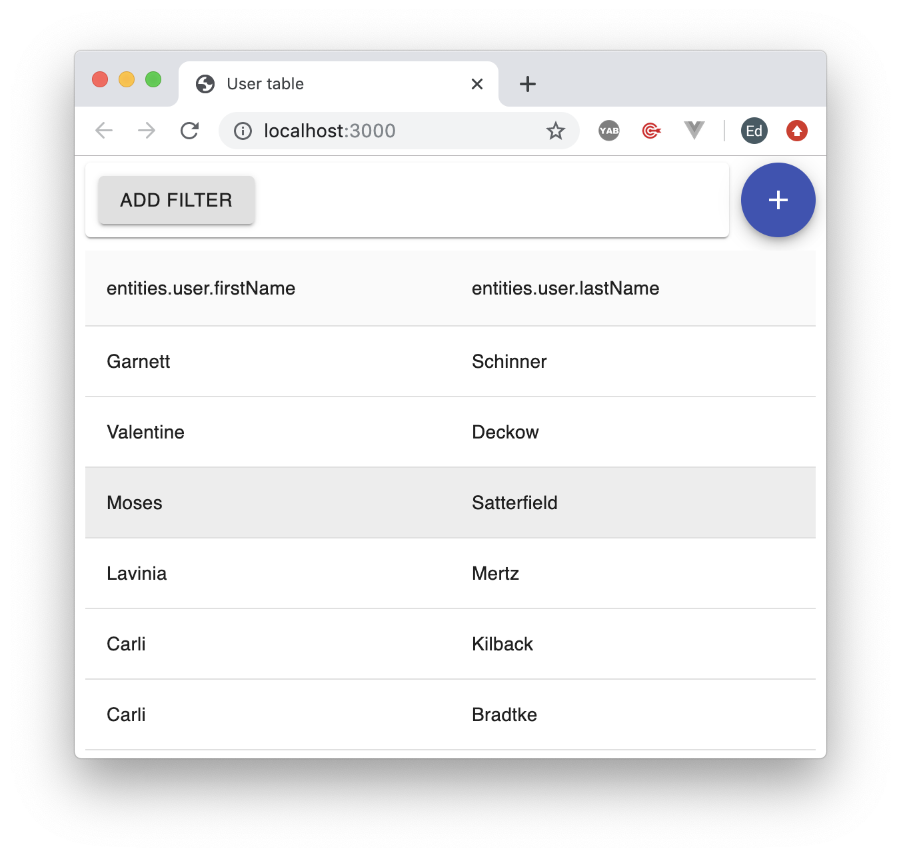
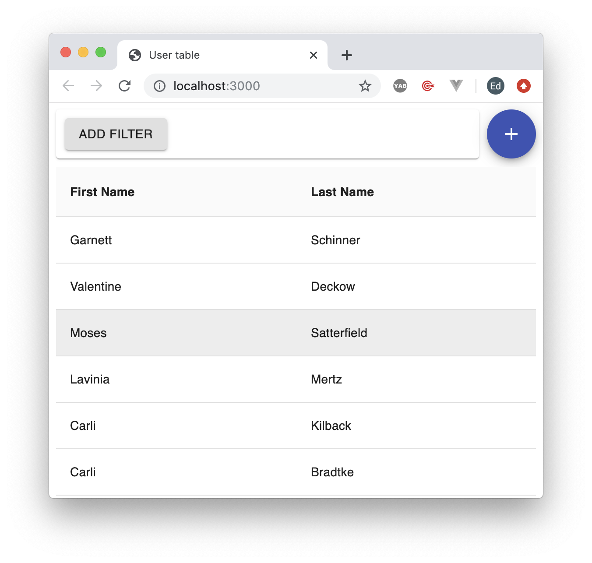
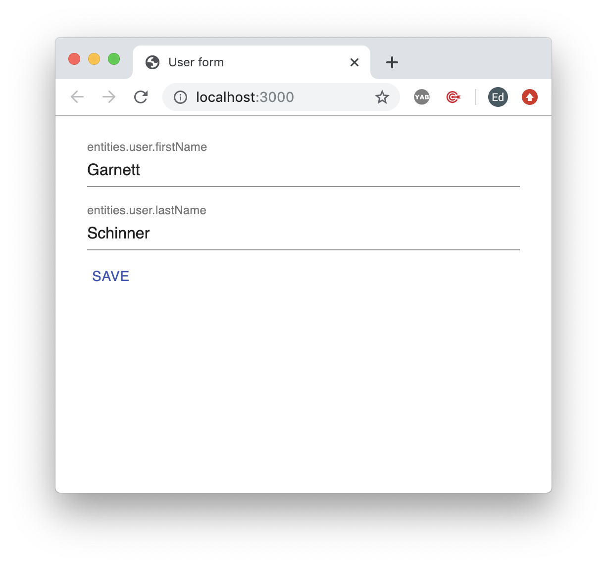

::: warning Tested Versions:

- JHipster v6.3.0
- Keycloak 8.0.1
- npm 6.12.1
- node 13.1.0

**Lesson Objectives**

- Generate an end-to-end app from a database model with Entando Blueprint
    - Run your app locally with hot / live reload
    - Learn how to customize the frontend, API, and persistence layers
    - Deploy your app to your local Kubernetes cluster
    - Display your micro frontends as widgets in Entando

Lesson Time: 30 minutes
:::

## Introduction

::: tip ENTANDO PLATFORM
- **Rapid Development**
    - Build an end-to-end web app in minutes
- **Modern Web Apps**
    - **Micro Frontend** and microservices architecture
    - Spring Boot backend | React/Angular/Vue micro frontend
- **Developer Productivity**
    - Hot / live reload for frontend and backend dev
- **Production Ready**
    - Auto-scale apps out of the box
- **Secure, Centralized Authentication**
    - Robust token-based auth across containers for micro frontends and microservices
- **Full DevOps Automation**
    - Containerized, siloed apps with explicit resource limits and sandboxed environments
:::

## App Generator

``` bash
npm install -g generator-jhipster@6.3.0
```

## Entando Blueprint

::: tip
This is the blueprint from which our app will be generated.
:::

1. Create a directory called `entando` from your terminal or command prompt to house all of our development.

*Note: We'll be using the command prompt a lot so it will be easier to create it close to your home directory (Mac) or root directory (C:/ drive on Windows).*

``` bash
mkdir entando
```

---

<br>

2. Go to the `entando` directory from the command line.

``` bash
cd entando
```

---

<br>

3. Clone the latest Entando Blueprint GitHub repository.

``` bash
git clone https://github.com/entando/entando-blueprint
```

You'll now have a new directory called `entando-blueprint`

---

<br>

4. Change directory to `entando-blueprint`.

``` bash
cd entando-blueprint
```

---

<br>

5. Link the Entando Blueprint in the global npm folder:

``` bash
npm link
```

::: tip
[`npm link`](https://docs.npmjs.com/cli/link.html) creates a symlink in the global npm folder that links to the `package` (See: `package.json`) in the current folder.

In our case, we've created a symlink called `generator-jhipster-entando` and installed it in the global npm directory (e.g., `~/.nvm/versions/node/v13.1.0/lib/node_modules`).
:::

::: warning Note
In a future update, we'll install the Entando Blueprint with `npm install`
:::

<br>

## Generate Microservice

1. Navigate back to the `/entando` directory.

``` bash
cd ..
```

---

<br>

2. Create a directory called `hello-world` for your app.

::: danger
Do not create the `hello-world` directory inside the `/entando-blueprint` directory.
:::

``` bash
mkdir hello-world
```

::: tip Checkpoint
You should now have a directory `entando/hello-world`
:::

---

<details><summary>Troubleshooting</summary>

If you receive the following error, you created your directory within the `entando-blueprint` folder.

- Exit out of the command prompt (`Ctrl-C`), delete the `hello-world` folder, and create it again: `/entando/hello-world`

``` bash
? What is the base name of your application? training
events.js:187
      throw er; // Unhandled 'error' event
      ^

TypeError: Cannot read property 'blueprint' of undefined
    at Object.getAllJhipsterConfig (/Users/ed/entando/entando-blueprint/node_modules/generator-jhipster/generators/utils.js:431:48)
    at module.exports.getAllJhipsterConfig (/Users/ed/entando/entando-blueprint/node_modules/generator-jhipster/generators/generator-base.js:2014:30)
    at module.exports.setupServerconsts (/Users/ed/entando/entando-blueprint/node_modules/generator-jhipster/generators/server/index.js:129:44)
    at Object.<anonymous> (/Users/ed/entando/entando-blueprint/node_modules/generator-jhipster/node_modules/yeoman-generator/lib/index.js:424:27)
    at /Users/ed/entando/entando-blueprint/node_modules/run-async/index.js:25:25
    at new Promise (<anonymous>)
    at /Users/ed/entando/entando-blueprint/node_modules/run-async/index.js:24:19
    at /Users/ed/entando/entando-blueprint/node_modules/generator-jhipster/node_modules/yeoman-generator/lib/index.js:425:13
    at processImmediate (internal/timers.js:439:21)
Emitted 'error' event on  instance at:
    at Immediate.<anonymous> (/Users/ed/entando/entando-blueprint/node_modules/generator-jhipster/node_modules/yeoman-generator/lib/index.js:433:22)
    at processImmediate (internal/timers.js:439:21)
```

</details>

---

<br>

3. Change directory to `hello-world`

``` bash
cd hello-world
```

---

<br>

4. Link the globally installed `generator-jhipster-entando` package to the `node_modules` directory of the current folder.

``` bash
npm link generator-jhipster-entando
```

::: warning Note
This creates a `node_modules` folder in `hello-world` with a symlink to `generator-jhipster-entando`
:::

---

<br>

5. Generate your app with Entando Blueprint.

``` bash
jhipster --blueprints entando
```

---

<br>

6. Select the following options:

- Which *type* of application would you like to create? `Microservice application`
- What is the base name of your application? `training`
- As you are running in a microservice architecture, on which port would like your server to run? It should be unique to avoid port conflicts. `8081`
- What is your default Java package name? `com.training`

::: warning Note
Press `Enter` to accept the defaults for each of the remaining of the options.
:::

<details><summary>Additional Options</summary>

- Which *type* of database would you like to use?
    - `SQL (H2, MySQL, PostgreSQL, Oracle)`
- Which *production* database would you like to use?
    - `MySQL`
- Which *development* database would you like to use?
    - `H2 with disk-based persistence`
- Do you want to use the Spring cache abstraction?
    - `Yes, with the Caffeine implementation (local cache, for a single node)`
- Do you want to use Hibernate 2nd level cache?
    - `Press Enter to select Yes`
- Would you like to use Maven or Gradle for building the backend?
    - `Maven`
- Which other technologies would you like to use?
    - `Press Enter without selecting any options`
- Would you like to enable internationalization support?
    - `Press Enter to select Yes`
- Please choose the native language of the application
    - `English`
- Please choose additional languages to install
    - `Press Enter without selecting any options`
- Besides JUnit and Jest, which testing frameworks would you like to use?
    - `Press Enter without selecting any options`
- Would you like to install other generators from the JHipster Marketplace?
    - `Press Enter to select No`

</details>

::: tip Congratulations!
With a few simple steps, we've created our first microservice application.
:::

::: warning Note
Don't run your Spring Boot application just yet. We'll first want to enable authentication and auto-generate our micro frontend widgets.
:::
<br>

## Add Database Entity

1. Create an entity in the database.

``` bash
jhipster entity User
```

---

<br>

2. Generate database fields.

``` bash
Generating field #1

Do you want to add a field to your entity? `y`
What is the name of your field? `firstName`
What is the type of your field? `String`
Do you want to add validation rules to your field? `n`

Generating field #2

- Do you want to add a field to your entity? `y`
- What is the name of your field? `lastName`
- What is the type of your field? `String`
- Do you want to add validation rules to your field? `n`

Generating field #3

- Do you want to add a field to your entity? `n`

Generating relationships to other entities

- Do you want to add a relationship to another entity? `n`
```

---

<br>

3. Generate service layer.

``` bash
Do you want to use separate service class for your business logic?
- `Yes, generate a separate service interface and implementation`
Do you want to add filtering?
- Dynamic filtering for the entities with JPA Static metamodel
Do you want pagination on your entity?
- `Yes, with infinite scroll`

Overwrite bundle/descriptor.yaml? `a`
overwrite this and all others `<Press Enter>`
```

<br>

::: tip Congratulations!

1. We've generated our first database entity.
2. We've also generated default micro frontends.
- `detailsWidget` Displays details for an individual `User`
- `formWidget` The form to add or edit a `User`
- `tableWidget` Displays the list of `Users` from the database.
:::

<br>

Optional: Review the generated files.

<details><summary>Sample Data</summary>

``` bash
   create src/main/resources/config/liquibase/changelog/20191211001659_added_entity_User.xml
   create src/main/resources/config/liquibase/fake-data/user.csv
```

</details>

---

<details><summary>Service Layer</summary>

``` bash
   create src/main/java/com/training/domain/User.java
   create src/main/java/com/training/repository/UserRepository.java
   create src/main/java/com/training/web/rest/UserResource.java
   create src/main/java/com/training/service/dto/UserCriteria.java
   create src/main/java/com/training/service/UserQueryService.java
   create src/main/java/com/training/service/UserService.java
   create src/main/java/com/training/service/impl/UserServiceImpl.java
   create src/test/java/com/training/web/rest/UserResourceIT.java
    force src/main/resources/config/liquibase/master.xml
    force src/main/java/com/training/config/CacheConfiguration.java
   create src/main/java/com/training/web/rest/schema/UserSchemaResource.java
```

</details>

---

<details><summary>detailsWidget</summary>

``` bash
   create ui/widgets/user/detailsWidget/bundle/details-widget-descriptor.yaml
   create ui/widgets/user/detailsWidget/bundle/details-widget.ftl
   create ui/widgets/user/detailsWidget/public/favicon.ico
   create ui/widgets/user/detailsWidget/public/index.html
   create ui/widgets/user/detailsWidget/public/robots.txt
   create ui/widgets/user/detailsWidget/src/api/constants.js
   create ui/widgets/user/detailsWidget/src/api/user.js
   create ui/widgets/user/detailsWidget/src/auth/KeycloakContext.js
   create ui/widgets/user/detailsWidget/src/auth/KeycloakViews.js
   create ui/widgets/user/detailsWidget/src/components/UserDetails.js
   create ui/widgets/user/detailsWidget/src/components/UserDetailsContainer.js
   create ui/widgets/user/detailsWidget/src/components/__mocks__/userMocks.js
   create ui/widgets/user/detailsWidget/src/components/__mocks__/i18n.js
   create ui/widgets/user/detailsWidget/src/components/__tests__/UserDetails.test.js
   create ui/widgets/user/detailsWidget/src/components/__tests__/UserDetailsContainer.test.js
   create ui/widgets/user/detailsWidget/src/components/__types__/user.js
   create ui/widgets/user/detailsWidget/src/components/__types__/keycloak.js
   create ui/widgets/user/detailsWidget/src/components/common/Notification.js
   create ui/widgets/user/detailsWidget/src/components/user-field-table/UserFieldTable.js
   create ui/widgets/user/detailsWidget/README.md
   create ui/widgets/user/detailsWidget/src/custom-elements/UserDetailsElement.js
   create ui/widgets/user/detailsWidget/jsconfig.json
   create ui/widgets/user/detailsWidget/src/custom-elements/widgetEventTypes.js
   create ui/widgets/user/detailsWidget/package-lock.json
   create ui/widgets/user/detailsWidget/src/helpers/widgetEvents.js
   create ui/widgets/user/detailsWidget/package.json
   create ui/widgets/user/detailsWidget/src/i18n/i18n.js
   create ui/widgets/user/detailsWidget/src/i18n/locales/index.js
   create ui/widgets/user/detailsWidget/src/index.js
```

</details>

---

<details><summary>formWidget</summary>

``` bash
   create ui/widgets/user/formWidget/.gitignore
   create ui/widgets/user/formWidget/bundle/form-widget-descriptor.yaml
   create ui/widgets/user/formWidget/bundle/form-widget.ftl
   create ui/widgets/user/formWidget/deploy-widget.sh
   create ui/widgets/user/formWidget/public/favicon.ico
   create ui/widgets/user/formWidget/public/index.html
   create ui/widgets/user/formWidget/public/robots.txt
   create ui/widgets/user/formWidget/scripts/i18next-scanner.config.js
   create ui/widgets/user/formWidget/src/api/constants.js
   create ui/widgets/user/formWidget/src/api/users.js
   create ui/widgets/user/formWidget/src/auth/KeycloakContext.js
   create ui/widgets/user/formWidget/src/auth/KeycloakViews.js
   create ui/widgets/user/formWidget/src/components/UserAddFormContainer.js
   create ui/widgets/user/formWidget/src/components/UserEditFormContainer.js
   create ui/widgets/user/formWidget/src/components/UserForm.js
   create ui/widgets/user/formWidget/src/components/__mocks__/userMocks.js
   create ui/widgets/user/formWidget/src/components/__tests__/UserAddFormContainer.test.js
   create ui/widgets/user/formWidget/src/components/__tests__/UserEditFormContainer.test.js
   create ui/widgets/user/formWidget/src/components/__tests__/UserForm.test.js
   create ui/widgets/user/formWidget/src/components/__types__/user.js
   create ui/widgets/user/formWidget/src/components/__types__/keycloak.js
   create ui/widgets/user/formWidget/src/components/common/Notification.js
   create ui/widgets/user/formWidget/src/custom-elements/UserFormElement.js
   create ui/widgets/user/formWidget/src/custom-elements/widgetEventTypes.js
   create ui/widgets/user/formWidget/src/helpers/widgetEvents.js
   create ui/widgets/user/formWidget/src/i18n/__mocks__/i18nMock.js
   create ui/widgets/user/formWidget/src/i18n/constants.js
   create ui/widgets/user/formWidget/src/i18n/dateFnsLocales.js
   create ui/widgets/user/formWidget/src/i18n/i18next.js
   create ui/widgets/user/formWidget/src/i18n/locales/index.js
   create ui/widgets/user/formWidget/src/i18n/setLocale.js
   create ui/widgets/user/formWidget/src/i18n/yup.js
   create ui/widgets/user/formWidget/src/index.js
   create ui/widgets/user/tableWidget/.gitignore
```

</details>

---

<details><summary>tableWidget</summary>

``` bash
   create ui/widgets/user/tableWidget/bundle/table-widget-descriptor.yaml
   create ui/widgets/user/tableWidget/bundle/table-widget.ftl
   create ui/widgets/user/tableWidget/deploy-widget.sh
   create ui/widgets/user/tableWidget/public/favicon.ico
   create ui/widgets/user/tableWidget/public/index.html
   create ui/widgets/user/tableWidget/public/robots.txt
   create ui/widgets/user/tableWidget/scripts/i18next-scanner.config.js
   create ui/widgets/user/tableWidget/src/api/constants.js
   create ui/widgets/user/tableWidget/src/api/users.js
   create ui/widgets/user/tableWidget/src/auth/KeycloakContext.js
   create ui/widgets/user/tableWidget/src/auth/KeycloakViews.js
   create ui/widgets/user/tableWidget/src/components/UserTable.js
   create ui/widgets/user/tableWidget/src/components/UserTableContainer.js
   create ui/widgets/user/tableWidget/src/components/__mocks__/userMocks.js
   create ui/widgets/user/tableWidget/src/components/__tests__/UserTable.test.js
   create ui/widgets/user/tableWidget/src/components/__tests__/UserTableContainer.test.js
   create ui/widgets/user/tableWidget/src/components/__types__/user.js
   create ui/widgets/user/tableWidget/src/components/__types__/filter.js
   create ui/widgets/user/tableWidget/src/components/__types__/keycloak.js
   create ui/widgets/user/tableWidget/src/components/common/Notification.js
   create ui/widgets/user/tableWidget/src/components/filters/Filter.js
   create ui/widgets/user/tableWidget/src/components/filters/FiltersContainer.js
   create ui/widgets/user/tableWidget/src/components/filters/utils.js
   create ui/widgets/user/tableWidget/src/components/pagination/PaginationContext.js
   create ui/widgets/user/tableWidget/src/components/pagination/PaginationWrapper.js
   create ui/widgets/user/tableWidget/src/components/pagination/TablePaginationActions.js
   create ui/widgets/user/tableWidget/src/custom-elements/UserTableElement.js
   create ui/widgets/user/tableWidget/src/custom-elements/widgetEventTypes.js
   create ui/widgets/user/tableWidget/src/helpers/widgetEvents.js
   create ui/widgets/user/tableWidget/src/i18n/__mocks__/i18nMock.js
   create ui/widgets/user/tableWidget/src/i18n/constants.js
   create ui/widgets/user/tableWidget/src/i18n/i18next.js
   create ui/widgets/user/tableWidget/src/i18n/locales/index.js
   create ui/widgets/user/tableWidget/src/i18n/setLocale.js
   create ui/widgets/user/tableWidget/src/index.js
   create ui/widgets/user/tableWidget/src/state/user.reducer.js
   create ui/widgets/user/tableWidget/src/state/user.types.js
   create ui/widgets/user/tableWidget/src/state/filter.types.js
```

</details>

---

<details><summary>Locales, package.json, README</summary>

Check out README.md for some helpful tips on development.

``` bash
   create ui/widgets/user/detailsWidget/src/i18n/locales/en.json
   create ui/widgets/user/detailsWidget/src/index.css
   create ui/widgets/user/formWidget/README.md
   create ui/widgets/user/formWidget/jsconfig.json
   create ui/widgets/user/formWidget/package-lock.json
   create ui/widgets/user/formWidget/package.json
   create ui/widgets/user/formWidget/src/i18n/locales/en.json
   create ui/widgets/user/tableWidget/README.md
   create ui/widgets/user/tableWidget/jsconfig.json
   create ui/widgets/user/tableWidget/package.json
   create ui/widgets/user/tableWidget/src/i18n/locales/en.json
```

</details>

---

<br>

## Authentication

::: tip
Entando provides robust, centralized authentication across containers for both micro frontends and microservices. This means that your micro frontends and microservices will be secured out of the box using token-based authentication.
:::

We want to develop locally for hot / live reload for both frontend and backend development. But first, we'll need to simulate having an authenticated user. To do that, we're going to install a local instance of Keycloak.

1. Install Keycloak.

::: tip
[Keycloak is an open source identity and access management solution which mainly aims at applications and services.](https://www.comakeit.com/blog/quick-guide-using-keycloak-identity-access-management/) Users can authenticate with Keycloak rather than individual applications. The applications don’t have to deal with login forms, authenticating users, or storing users. Once logged in to Keycloak, users don’t have to login again to access different applications.
:::

a. Download Keycloak.

Look for the `Standalone server distribution`.

https://www.keycloak.org/archive/downloads-8.0.1.html

---

b. Unzip it in your `entando` directory.

`/entando/keycloak-8.0.1`

---

c. Open up a **new** command line window.

---

d. Navigate to the `/entando/keycloak-8.0.1/bin` directory.

<details><summary>Example</summary>

``` bash
cd /Users/ed/entando/keycloak-8.0.1/bin
```

</details>

---

e. Startup the Keycloak server.

``` bash
./standalone.sh -Djboss.socket.binding.port-offset=1000
```

- This will offset the Keycloak port to 9080.
- The server should start up in ~60 seconds without any exceptions.

<details><summary>Console</summary>

``` bash
17:17:04,220 INFO  [org.wildfly.extension.undertow] (ServerService Thread Pool -- 68) WFLYUT0021: Registered web context: '/auth' for server 'default-server'
17:17:04,277 INFO  [org.jboss.as.server] (ServerService Thread Pool -- 55) WFLYSRV0010: Deployed "keycloak-server.war" (runtime-name : "keycloak-server.war")
17:17:04,343 INFO  [org.jboss.as.server] (Controller Boot Thread) WFLYSRV0212: Resuming server
17:17:04,346 INFO  [org.jboss.as] (Controller Boot Thread) WFLYSRV0060: Http management interface listening on http://127.0.0.1:9990/management
17:17:04,346 INFO  [org.jboss.as] (Controller Boot Thread) WFLYSRV0051: Admin console listening on http://127.0.0.1:9990
17:17:04,346 INFO  [org.jboss.as] (Controller Boot Thread) WFLYSRV0025: Keycloak 8.0.1 (WildFly Core 10.0.3.Final) started in 48942ms - Started 590 of 885 services (601 services are lazy, passive or on-demand)
```

</details>

---

f. Open up a browser, and go to `http://localhost:9080/auth/`.

<details><summary>Screenshot</summary>



</details>

---

<br>

2. Create an initial admin user.

- Username `admin`
- Password `admin`

---

<br>

3. Create a `Realm`.

::: tip
[The core concept in Keycloak is a Realm. A realm secures and manages security metadata for a set of users, applications, and registered oauth clients.](http://www.mastertheboss.com/jboss-frameworks/keycloak/introduction-to-keycloak) Users and roles can be defined at the realm level and you can also set up user role mappings to assign permissions to specific users.
:::

a. Click `Administration Console`

---

b. Log in with your admin user name and password.

---

c. Hover over the `Master` drop down to add a `Realm`

::: warning Note
We initially start in the `Master` realm. This is reserved for super admin users. It's recommended not to add any users to this realm.
:::

<details><summary>Screenshot</summary>



</details>

---

d. Click `Add realm`

- Name: `jhipster`

---

e. Click `Create`

::: warning Note
The `Realm` dropdown should now say `Jhipster`
:::

---

<br>

4. Add a `Client`

::: tip
A `Client` can be an application or REST API.
:::

---

a. Click `Clients`

---

b. Click `Create`

- Client ID `jhipster-entando-react-client`
- Client Protocol - `openid-connect`
- Root URL - `http://localhost:3000/`

---

c. Click `Save`

---

<br>

5. Add a user.

a. Click `Users`

---

b. Click `Add user`

- Username: `test`

---

c. Click `Save`

---

d. Click `Credentials`

---

e. Set Password.

- `test`

---

<br>

6. Update security settings for your microservice application.

a. Open `SecurityConfiguration.java`

`entando/hello-world/src/main/java/com/training/config/SecurityConfiguration.java`

---

i. Add `import org.springframework.http.HttpMethod;`

---

ii. Add `HTTP OPTIONS`

- Find `.antMatchers("/api/auth-info").permitAll()`
- Append `.antMatchers(HttpMethod.OPTIONS,"/api/**").permitAll()`

<details><summary>Screenshot</summary>



</details>

---

<br>

7. Enable `Cross-Origin Resource Sharing (CORS)`.

::: tip
[Cross-Origin Resource Sharing (CORS) is a mechanism that uses additional HTTP headers to tell browsers to give a web application running at one origin, access to selected resources from a different origin.](https://developer.mozilla.org/en-US/docs/Web/HTTP/CORS) A web application executes a cross-origin HTTP request when it requests a resource that has a different origin (domain, protocol, or port) from its own.
:::

a. Open `application.yml`

`/entando/hello-world/src/main/resources/config/application.yml`

---

b. Uncomment CORS configuration.

``` bash
  cors:
    allowed-origins: "*"
    allowed-methods: "*"
    allowed-headers: "*"
    exposed-headers: "Authorization,Link,X-Total-Count"
    allow-credentials: true
    max-age: 1800
```

## Run It!

Now we're ready to see our code in action! Let's start up our microservice.

1. Run your micoservice application.

---

a. Go to your original command line window where you built your microservice application.

---

b. Run your app.

``` bash
./mvnw
```

Check to make sure there are no exceptions in the log.

---

<br>

2. Simulate an authenticated user.

---

a. Open a new browser, and go to:

`http://localhost:9080/auth/realms/jhipster/account/`

---

b. Log in with the user you created in the `Jhipster` realm.

- Username: `test`
- Password: `test`

::: warning Note
You can also impersonate the user using the admin account.

`Users` > `View all users` > `Impersonate`
:::

---

<br>

3. Run your micro frontend (widget).

---

a. Create a file `.env` in the directory:

`/entando/hello-world/ui/widgets/user/tableWidget`

---

b. Add a `process.env` variable.

`REACT_APP_DOMAIN=http://localhost:8081/services/training/api`

---

c. Open a new command line window, and navigate to:

`/entando/hello-world/ui/widgets/user/tableWidget`

---

d. Run `npm i`

---

e. Run `npm start`

<details><summary>Screenshot</summary>



</details>

---

<br>

## Frontend Layer

The default `tableWidget` displays a list of users with sample data. It provides a clean, modern UI that you can easily style to meet your company's style guidelines.

Check out [Material UI](https://material-ui.com/components/tables/) for more options for styling your data.

::: tip
Entanto micro frontends can be displayed standalone as you see here, or as micro frontends that are assembled onto a single page.
:::

Let's make some simple changes to refine the look and feel of our table.

1. Update table header.

---

a. Open `en.json` in the directory:

`/entando/hello-world/ui/widgets/user/tableWidget/src/i18n/locales`

---

b. Localize table header values.

- `"firstName": "First Name",`
- `"lastName": "Last Name"`

``` js
  "entities": {
    "user": {
      "noItems": "No users available",
      "id": "ID",
      "firstName": "First Name",
      "lastName": "Last Name"
    }
  }
```

We can easily localize our micro frontends for multiple locales.

---

<br>

2. Bold table header.

---

a. Open `UserTable.js` in the directory:

`/entando/hello-world/ui/widgets/user/tableWidget/src/components`

---

b. Add bold styling.

``` js
    <Table className={classes.tableRoot} stickyHeader>
      <TableHead>
        <TableRow>
          <TableCell>
            <span><b>{t('entities.user.firstName')}</b></span>
          </TableCell>
          <TableCell>
            <span><b>{t('entities.user.lastName')}</b></span>
          </TableCell>
        </TableRow>
      </TableHead>
      <TableBody>{tableRows}</TableBody>
    </Table>
```

<details><summary>Screenshot</summary>



</details>

::: tip
Entando automatically generates all of the widgets needed for a generic CRUD app. This reduces the time you spend writing boilerplate code so you can focus on your business requirements.

Each widget is generated as a `create react app`, and can be easily modified to suit your needs.
:::

---

<br>

## Service Layer

Next, let's modify the service layer to change our business logic.

1. Add basic validation.

a. Open `UserServiceImpl.java` in the directory:

`/entando/hello-world/src/main/java/com/training/service/impl`

---

b. Find the `save` method.

``` java
public User save(User user) {
```

---

c. Check if first name is null.

``` java
@Override
public User save(User user) {
    log.debug("Request to save User : {}", user);
    if (user.getFirstName() == null) {
        log.debug("First name is null");
    }
    return userRepository.save(user);
}
```

---

<br>

2. Run the user form micro frontend (widget).

---

a. Stop the tableWidget.

- Open the command line window that you used to run the table widget.
- Press `Ctrl-C` to exit out of the running process.

---

b. Add `process.env` variable.

Let's save time by copying the `.env` file we created for the table widget.

- Copy the `.env` file in the directory:
    - `/entando/hello-world/ui/widgets/user/tableWidget`
- Paste the `.env` file to the `formWidget` directory:
    - `/entando/hello-world/ui/widgets/user/formWidget`

---

c. Navigate to the `formWidget` directory in your command line.

<details><summary>Example</summary>

``` bash
cd /Users/ed/entando/hello-world/ui/widgets/user/formWidget
```

</details>

---

d. Run `npm i`

---

e. Run `npm start`

<details><summary>Screenshot</summary>



</details>

::: warning Note
If you see the message: `User is not authenticated.`

- Re-login with your test user account to get another authentication token.
    - `http://localhost:9080/auth/realms/jhipster/account/applications`
:::

---

<br>
