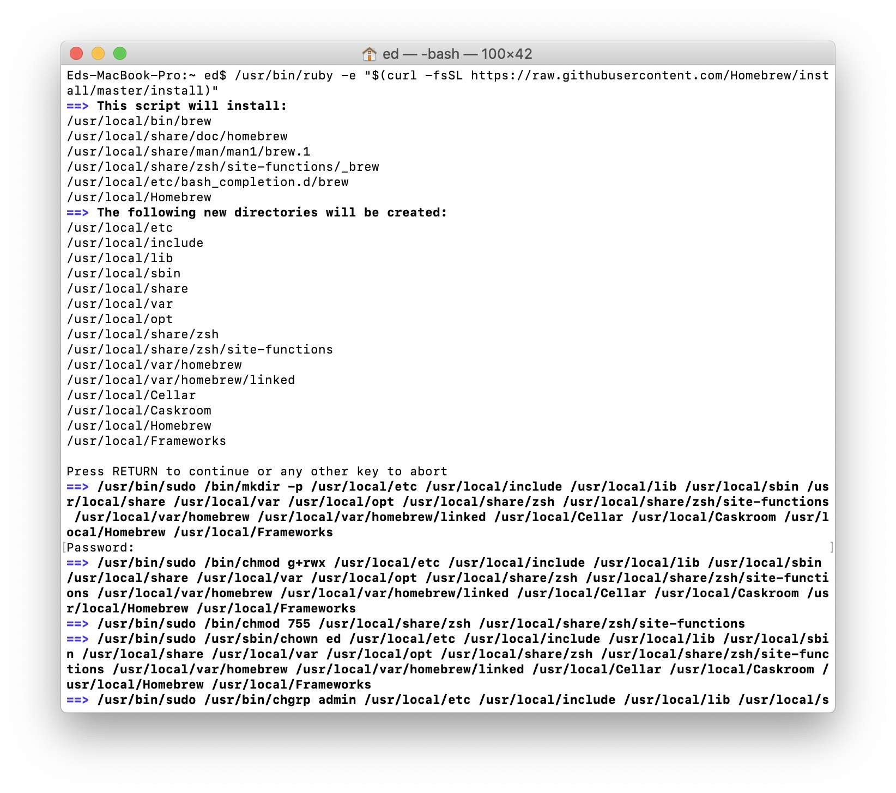
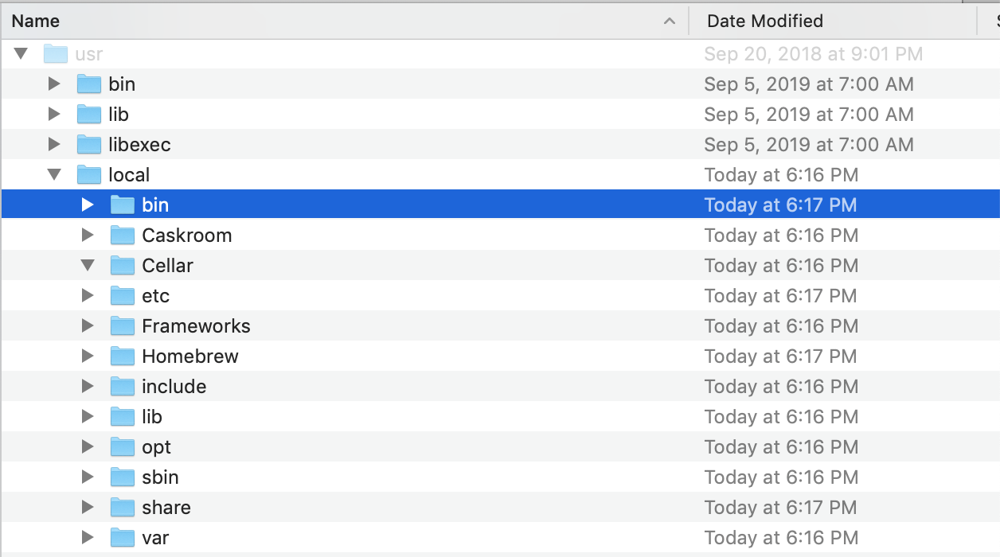
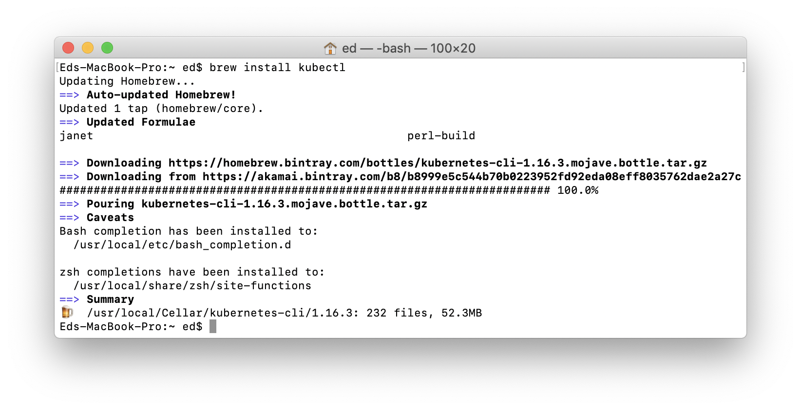
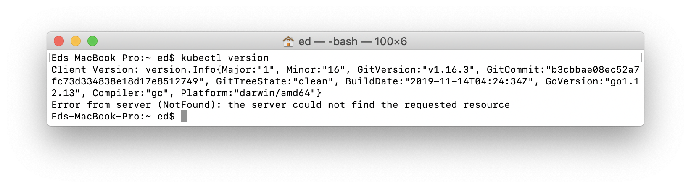
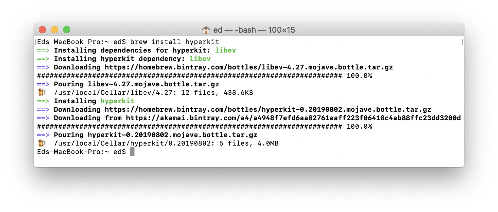
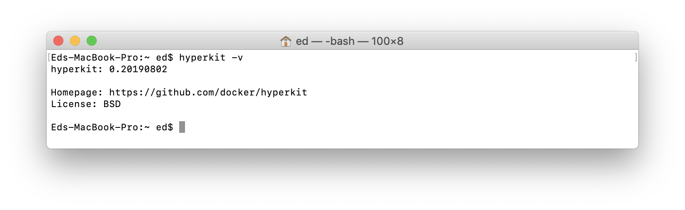
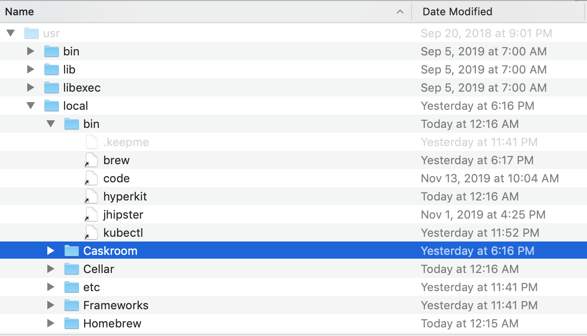
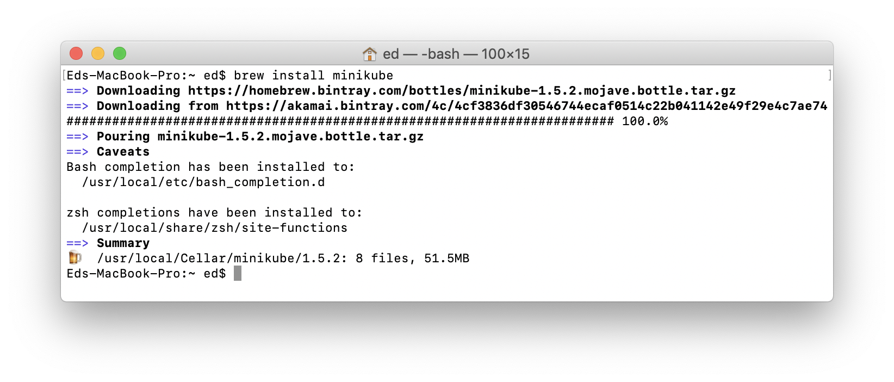
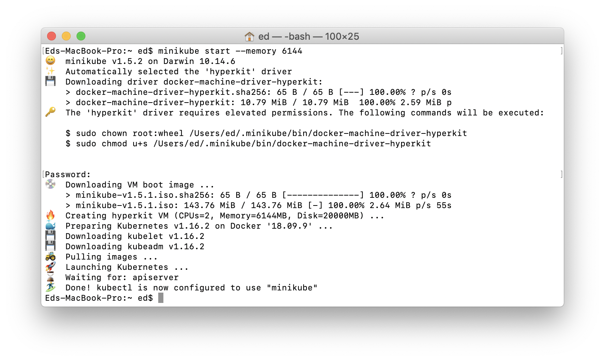
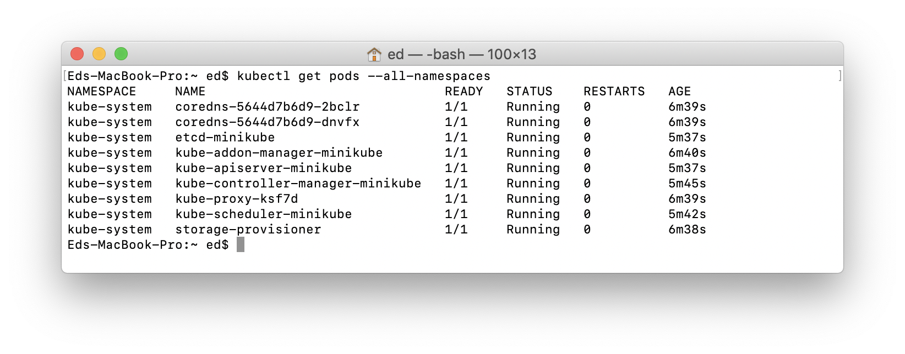

::: warning Tested Versions:
*To provide a step-by-step walkthrough, this tutorial focuses on installation on MacOS. The instructions are similar for Windows 10 users.*

System Requirements: 8GB RAM

- MacOS Mojave
- kubectl 1.16.3
- hyperkit 0.20190802
- minikube 1.5.2

**Lesson Objectives**

- A native, local install of Kubernetes

Lesson Time: 15-30 minutes
:::

# Getting Started

This tutorial is designed to give you a fast, simple, and lightweight install of Kubernetes. It will also teach you practical tips on how to use Kubernetes so you can learn as you go.

::: tip
VMs virtualize hardware. Kubernetes virtualizes the operating system.
:::

# Install Minikube

To get Entando up and running, we'll need to install Kubernetes. We'll be using Minikube with a native hypervisor for lightweight and fast performance.

[MiniKube has excellent documentation with installation instructions for every OS.](https://kubernetes.io/docs/tasks/tools/install-minikube/) Make sure to allocate enough memory to Minikube to support the installation of Entando. The below instructions focus on MacOS.

## Package Manager

[Homebrew](https://brew.sh) is a package manager for MacOS. We'll be using it to simplify the rest of the install.

1. Open your Terminal, and install Homebrew.

``` bash
/usr/bin/ruby -e "$(curl -fsSL https://raw.githubusercontent.com/Homebrew/install/master/install)"
```

<details><summary>Screenshot</summary>



</details>

---

<br>

2. Verify brew install.

``` bash
brew -v
```

<details><summary>Screenshot</summary>


</details>

---

<br>

3. Optional: Navigate to `/usr/local` to see the directories that brew created.

<details><summary>Screenshot</summary>



</details>

---

<br>

## Kube Command Line Interface

1. Install kubectl.

``` bash
brew install kubectl
```

<details><summary>Screenshot</summary>



</details>

---

<br>

2. Verify kubectl install.

``` bash
kubectl version
```

<details><summary>Screenshot</summary>



</details>

---

<br>

## Hypervisor

::: tip
Hyperkit includes a native hypervisor which is used to create and run lightweight virtual machines and deploy containers.
:::

1. Install hyperkit.

``` bash
brew install hyperkit
```

<details><summary>Screenshot</summary>



</details>

---

<br>

2. Verify hyperkit install.

``` bash
hyperkit version
```

<details><summary>Screenshot: Hyperkit Version</summary>



</details>

---

<details><summary>Screenshot: Hyperkit Driver</summary>



</details>

---

<br>

## Minikube

1. Install minikube.

``` bash
brew install minikube
```

<details><summary>Screenshot</summary>



</details>

---

<br>

2. Start Minikube.

::: danger
Although Minikube will start with the default memory settings (Memory=2000MB), we'll want to allocate enough memory to install the supporting infrastructure for Entando, which includes a database server, identity management server, and application server.
:::

::: warning Memory Settings
If your machine has 16GB of RAM or more, allocate 8GB of RAM to the VM. This is required step for developers to deploy your apps locally.

`minikube start --memory 8192`
:::

``` bash
minikube start --memory 6144
```

<details><summary>Screenshot</summary>



</details>

::: tip Congratulations!
We now have a lightweight installation of Kubernetes running on your machine. Let's take a moment to familiarize ourselves with the environment. 
:::

---

<br>

3. See what pods are running on a clean install.

``` bash
kubectl get pods --all-namespaces
```

<details><summary>Screenshot</summary>



</details>

---

<details><summary>What is a Pod?</summary>

There are nine default pods that come with a clean install of Minikube. By reading the pod names, you can get a better idea of what's running in the system. This will help us to troubleshoot when we start installing our own pods.

::: tip
A pod is a group of one or more containers that share the same network and storage. [Containers within a pod share an IP address and port space and can find each other via `localhost`.](https://kubernetes.io/docs/concepts/workloads/pods/pod/)

Pods are meant to be ephemeral and are simply replaced by a new pod upon failure or termination. Pods are how Kubernetes delivers applications (or software) as a service. Multiple instances of a Pod can be deployed for horizontal scaling and replication.
:::

</details>

---

<br>

4. Optional: Deploy your first app.

<details><summary>Steps</summary>

If you want to deploy an app right away, Minikube has an excellent tutorial that you can complete in five minutes. [Try out steps 2 - 8 of the Minikube tutorial.](https://kubernetes.io/docs/setup/learning-environment/minikube/).

</details>

---

<br>

5. Optional: Stop Minikube

<details><summary>Steps</summary>

``` bash
minikube stop
```

When you're finished testing, you'll want to stop minikube to keep it from taking up resources when you're not using it. Don't forget to start it up again before the next lesson.

</details>