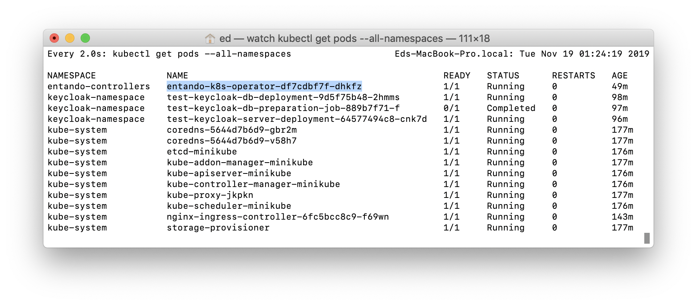
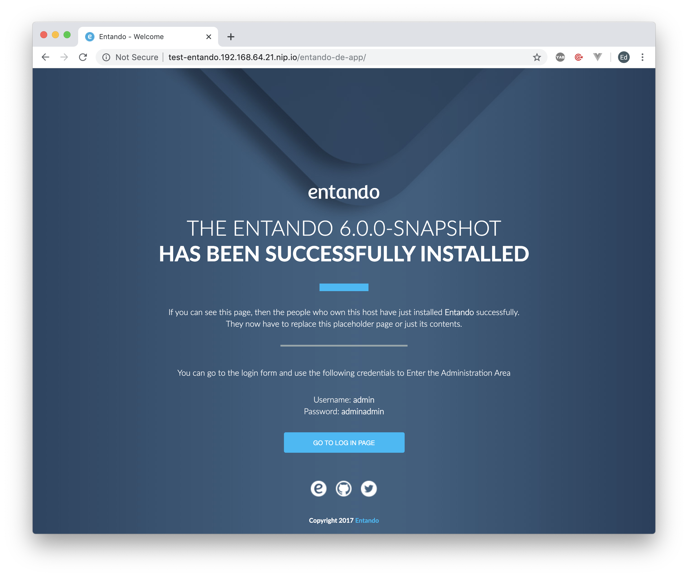
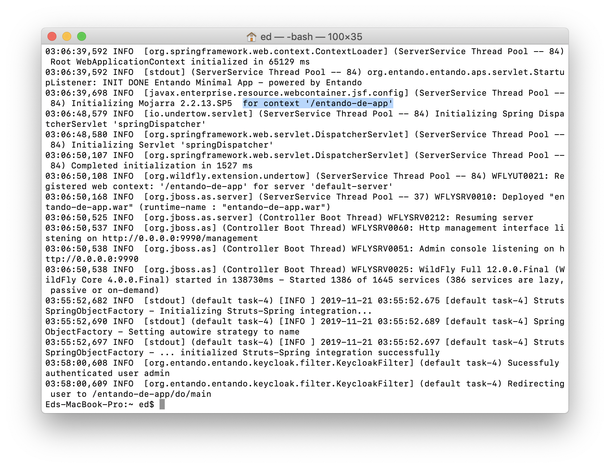

::: warning Lesson Objectives
A local instance of Entando up and running:

- Entando Operator (Controller)
- Identity Management Server (Keycloak)
- Entando Cluster Infrastructure
- Entando Application (6.0.0-SNAPSHOT)

Lesson Time: 60 minutes
:::

# Install Entando

Now that we have a native install of Kubernetes running, let's install Entando.

::: tip Entando
Entando is a Kubernetes-native rapid application development platform. It supports modern development frameworks like Vue/Angular/React and Spring Boot, a microservice and micro frontend architecture, and automated DevOps lifecycles to support continuous innovation with faster release cycles.
:::

## Watch Command

::: tip
The `watch` command makes it easy to look at logs by automatically refreshing the logs.
:::

We'll be looking at a number of logs to take checkpoints after each step, and to learn about what's going on behind the scenes.

1. Install the `watch` command.

``` bash
brew install watch
```

---

<br>

## Enable Ingress

::: tip Ingress
`Ingress` manages external access to services in a cluster, exposes external HTTP routes to services within the cluster, and can act as a load balancer.
:::

::: tip
`Ingress` must be enabled to access services running within our Kubernetes cluster (or VM) like our identity management server and the Entando app from a local browser.
:::

1. Enable Ingress.

``` bash
minikube addons enable ingress
```

---

<br>

2. Open another `Terminal` window, and verify that ingress is enabled.

We'll use this Terminal to monitor pods that are created and their statuses.

::: tip
This command gets the pods for all namespaces within our cluster.

`Namespaces` can be used to sandbox containers and restrict permissions within your cluster.
:::

``` bash
watch kubectl get pods --all-namespaces
```

There should be a new pod `nginx-ingress-controller...` with status `ContainerCreating`.

<details><summary>Screenshot</summary>


</details>

Wait for the nginx-ingress-controller to be `Status` `Running`.

<details><summary>Screenshot</summary>


</details>

---

<br>

## Entando Operator

::: tip Kubernetes Operators
`Operators` allow DevOps teams to extend Kubernetes to automate repeatable tasks specific to their organization. They are intended to mimic a human operator with deep knowledge of the system to further automate the maintenance and running of containers in production.
:::

::: tip
`Operators` are typically `Controllers` for custom resources like the `EntandoApp`.
:::

1. Download <a href='./../custom-resources.zip' download>custom-resources.zip</a>

---

<br>

2. Unzip `custom-resources.zip` to your home directory.

<details><summary>Screenshot</summary>


</details>

---

<br>

3. Open `Terminal`, and navigate to your `custom-resources` folder.

``` bash
cd ~/custom-resources/
```

---

<br>

3. Create a namespace in your Kubernetes cluster to install the operator (controller).

``` bash
kubectl create namespace entando-controllers
```

<details><summary>Screenshot</summary>


</details>

---

<br>

4. Assign the cluster-admin cluster role to the entando-controllers default service account.

``` bash
kubectl create clusterrolebinding entando-controllers --clusterrole=cluster-admin --serviceaccount=entando-controllers:default
```

<details><summary>Screenshot</summary>


</details>

---

<br>

5. Find your Minikube IP.

``` bash
minikube ip
```

<details><summary>Screenshot</summary>


</details>

---

<br>

6. Open `~/custom-resources/operator.yaml`.

---

<br>

7. Modify the value of `ENTANDO_DEFAULT_ROUTING_SUFFIX` to `<YOUR_MINIKUBE_IP>.nip.io`.

<details><summary>See the screenshot for an example.</summary>


::: warning Note
In the screenshot, we've updated the value of `ENTANDO_DEFAULT_ROUTING_SUFFIX` to `192.168.64.20.nip.io`.
:::

</details>

---

<br>

8. Create the Entando `Operator`.

``` bash
kubectl create -f operator.yaml -n entando-controllers
```

---

<br>

9. Verify the Entando operator was created.

``` bash
watch kubectl get pods --all-namespaces
```

::: tip Checkpoint
Look for a new pod `entando-k8s-operator...` with status `ContainerCreating`.

Wait for the entando-k8s-operator to be `Running`.
:::

<details><summary>Screenshot</summary>


</details>

---

<br>

## Install Keycloak

1. Create a namespace in your Kubernetes cluster to install Keycloak.

``` bash
kubectl create namespace keycloak-namespace
```

---

<br>

2. Create the `EntandoKeycloakServer` `Resource`.

``` bash
kubectl create -f keycloak-server.yaml -n keycloak-namespace
```

---

<br>

3. Verify the Keycloak instance was created.

``` bash
watch kubectl get pods --all-namespaces
```

It will take ~15 minutes for all of the pods to start up and finish running.

::: tip Checkpoint
- `test-keycloak-db-deployment...` is `1/1` and `Running`.
- `test-keycloak-db-preparation-job...` is `0/1` and `Completed`.
- `test-keycloak-server-deployment...` is `1/1` and `Running`.
:::

<details><summary>Screenshot</summary>


</details>

---

<details><summary>Troubleshooting</summary>

::: warning What to do if your pods are constantly restarting.
- `kube-controller-manager-minikube`
- `kube-scheduler-minikube`
- `nginx-ingress-controller`
- `test-keycloak-server-deployment`
:::

When a pod consumes more memory than Kubernetes has available, it will try to self-heal by restarting the pod to free up memory. If this is happening, check to see that you've allocated enough memory to Minikube. If you don't have 6GB RAM dedicated to minikube, run `minikube delete`, and [start again from this step](../getting-started/README.md#minikube) to see if it fixes the issue.

</details>

---

<br>

4. Verify `keycloak-admin-secret` was created.

``` bash
kubectl get secrets keycloak-admin-secret -n entando-controllers
```

<details><summary>Screenshot</summary>


</details>

---

<details><summary>Troubleshooting</summary>

::: danger Error
`keycloak-admin-secret` not found.
:::


a. Delete the `keycloak-namespace`, and re-create it from scratch.

``` bash
kubectl delete namespace keycloak-namespace
```

``` bash
kubectl create namespace keycloak-namespace
```

``` bash
kubectl create -f keycloak-server.yaml -n keycloak-namespace
```

</details>

---

<br>

::: warning For Developers
Learn how Kubernetes works behind the scenes.
:::

<details><summary>Checkpoints</summary>

::: tip Checkpoint
Check out Keycloak from your browser.
:::

<details><summary>Steps</summary>


a. Find the ingress for the keycloak-namespace.

::: tip
This gets the host name of the keycloak-namespace in your Kubernetes cluster.
:::

``` bash
kubectl get ingress -n keycloak-namespace
```


b. Copy and paste the value under `HOSTS` in your browser and add `/auth` at the end.

In the above screenshot, the URL would be: `test-keycloak.192.168.64.20.nip.io/auth`

::: tip
[nip.io](https://nip.io/) is a service that allows you to map any IP address to a host name without having to edit your `etc/hosts` file.

For example, `test-keycloak.192.168.64.20.nip.io` maps to `192.168.64.20` in your Kubernetes cluster.
:::

</details>

<details><summary>Troubleshooting</summary>

a. Double check to see that you've entered the ingress URL correctly.

b. Advanced: If you're using DD-WRT or another open source firmware for your router, check to see if `DNSMasq` is configured to be your local DNS server.

Because `DNSMasq` will reject addresses from upstream nameservers in private IP ranges, you can try whitelisting the domain `nip.io` using the option `--rebind-domain-ok`, or you can try disabling `DNSMasq` as your local DNS server.

Use `dig` to determine if your ingress is resolving correctly.

``` bash
dig +short test-keycloak.<YOUR_MINIKUBE_IP>.nip.io
```


See the following links for more information:

- <https://stackoverflow.com/questions/43834159/minishift-could-not-resolve-192-168-64-2-nip-io>
- <https://forum.openwrt.org/t/nip-io-doesnt-work-for-local-network-behind-lede-solved-dns-rebind-protection/7766/2>
- <http://www.thekelleys.org.uk/dnsmasq/docs/dnsmasq-man.html>

</details>

---

<br>

::: tip Checkpoint
Learn where to view the Keycloak server logs.
:::

<details><summary>Steps</summary>

a. Copy the name of the `keycloak-server-deployment` pod from your Terminal.


b. View the logs for the `keycloak-server-deployment` pod.

``` bash
kubectl logs <YOUR_KEYCLOAK_SERVER_DEPLOYMENT> -n keycloak-namespace
```

::: warning SAMPLE
kubectl logs test-keycloak-server-deployment-64577494c8-cnk7d -n keycloak-namespace
:::

In the server logs, we can see the `/auth` web context as well as the successful startup of the server.


</details>

---

<br>

::: tip Checkpoint
Learn about the full operator lifecycle by checking out the Entando `Operator` logs.
:::

<details><summary>Steps</summary>

a. Copy the name of the `entando-k8s-operator` pod.



b. View the logs for the `entando-k8s-operator` pod.

``` bash
kubectl logs <YOUR_ENTANDO_K8S_OPERATOR> -n entando-controllers
```

::: warning
If you see an exception thrown in the Entando `Operator` logs, that means the deployment of the Entando custom `Resource` has failed.
:::

Note: The `SEVERE` messages are for debugging purposes and can be safely ignored.

---

<br>

c. What to do when an exception is thrown:

- If you see an exception like the one below in your Entando `Operator` logs, delete the `keycloak-namespace` and re-create it.


</details>

</details>

---

<br>    

## Entando Infrastructure

1. Create a namespace to install the Entando Cluster Infrastructure.

``` bash
kubectl create namespace entando-infra-namespace
```

---

<br>

2. Add the `cluster-admin` role to the default service account for the `entando-infra-namespace`.

- This is required for the `k8s-service`.

``` bash
kubectl create clusterrolebinding entando-k8ssvc --clusterrole=cluster-admin --serviceaccount=entando-infra-namespace:default
```
---

<br>

3. Create the `EntandoClusterInfrastructure` resource.

``` bash
kubectl create -f entando-infra.yaml -n entando-infra-namespace
```

---

<br>

4. Verify the `EntandoClusterInfrastructure` pods were created.

``` bash
watch kubectl get pods --all-namespaces
```

It will take ~15 minutes for all of the pods to start up and finish running.

::: tip Checkpoint
- `eti-db-preparation-job...` is `0/1` and `Completed`.
- `eti-dig-ex-deployment...` is `1/1` and `Running`.
- `eti-digexdb-deployment...` is `1/1` and `Running`.
- `eti-k8s-svc-deployment...` is `1/1` and `Running`.
- `eti-user-mgmt-deployment...` is `1/1` and `Running`.
:::

<details><summary>Screenshot</summary>


</details>

---

<details><summary>Troubleshooting</summary>

If all of the infrastructure pods were not created successfully, delete the `entando-infra-namespace`, and re-create it.

``` bash
kubectl delete namespace entando-infra-namespace
```

``` bash
kubectl create namespace entando-infra-namespace
```

``` bash
kubectl create -f entando-infra.yaml -n entando-infra-namespace
```

</details>

---

<br>

## Entando Application

1. Create a namespace to install the Entando Application

``` bash
kubectl create namespace test-namespace
```

---

<br>

2. Create the `EntandoApp` resource.

``` bash
kubectl create -f entando-app.yaml -n test-namespace
```

---

<br>

3. Verify the `EntandoApp` pods were created.

``` bash
watch kubectl get pods --all-namespaces
```

It will take ~15 minutes for all of the pods to start up and finish running.

::: tip Checkpoint
- `test-entando-db-deployment...` is `1/1` and `Running`.
- `test-entando-db-preparation-job...` is `0/1` and `Completed`.
- `test-entando-server-deployment...` is `3/3` and `Running`.
:::

<details><summary>Screenshot</summary>


</details>

---

<details><summary>Troubleshooting</summary>

If all of the pods were not created successfully, delete `test-namespace`, and re-create it.

``` bash
kubectl delete namespace test-namespace
```

``` bash
kubectl create namespace test-namespace
```

``` bash
kubectl create -f entando-app.yaml -n test-namespace
```

</details>

---

<br>

4. Open the Entando app by entering the following URL in your browser:

`test-entando.<YOUR_MINIKUBE_IP>.nip.io/entando-de-app`

::: tip
How to find your Minikube IP.
:::

``` bash
minikube ip
```

<details><summary>Screenshot</summary>



</details>

---

<br>

5. Log in with username `admin` and password `adminadmin`.

a. Enter a new password to activate your account.

<details><summary>Screenshot: Entando Dashboard</summary>


</details>

---

<br>

::: tip Congratulations!
You now have a native Kubernetes cluster running Entando on your local machine.
:::
---

<br>

::: warning For Developers
Check out what's happening behind the scenes.
:::

<details><summary>View the Entando server logs.</summary>

a. Find the pod for the `EntandoApp` server.


b. View the logs.

``` bash
kubectl logs <YOUR_TEST_ENTANDO-SERVER-DEPLOYMENT> -n test-namespace
```

::: warning
An error comes up letting us know that we must specify a container name for the logs. It conveniently displays the list of available containers to us. We're interested in the `test-entando-server-container`.
:::

Note: `test-entando-de-container` is the Entando Digital Exchange, and `test-entando-appbuilder-container` is the App Builder.


c. Specify the container.

``` bash
kubectl logs <YOUR_TEST_ENTANDO-SERVER-DEPLOYMENT> -n test-namespace -c test-entando-server-container
```


d. Verify the `EntandoApp` server started up successfully, and the `/entando-de-app` context.



</details>

---

<details><summary>How to find the host name.</summary>

a. Get the ingress for `test-namespace`.

``` bash
kubectl get ingress -n test-namespace
```


</details>

---

<br>

## What's Next?

Stay tuned! More tutorials are coming soon where we'll cover how to build your first app on Entando, or check out our official documentation at [docs.entando.com](http://docs.entando.com/).

If you'd like to learn more about how Entando can help support your move to the hybrid cloud and rapidly build apps on Kube, contact us at sales@entando.com.